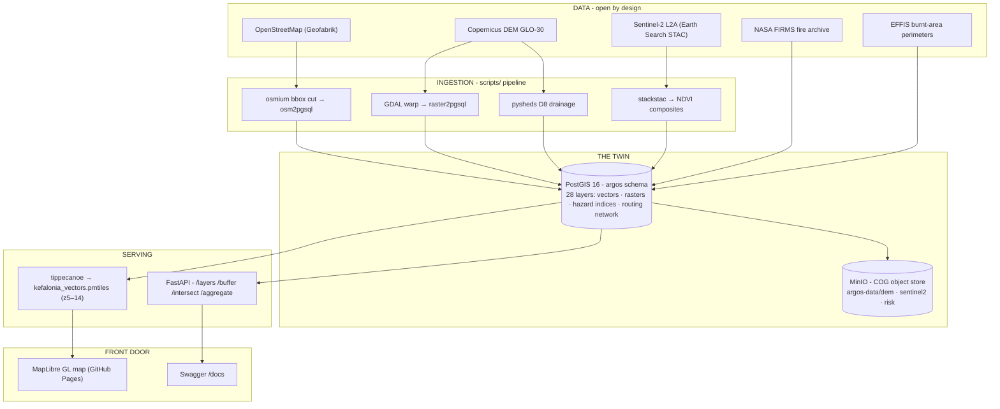

# ARGOS : : Kefalonia Digital Twin

**Watching over the places we call home.**
*«Προστατεύοντας τους τόπους μας»*

ARGOS is an open-source digital twin of **Kefalonia, Greece** - one island, fully mapped,
queryable, and watchable. Built in public by one person, on free/open data and free-tier
infrastructure.

**[🗺️ Open the live map](https://argos-geo.github.io/kefalonia-digital-twin/)** - roads,
buildings, beaches, trails, wildfire risk, and per-building travel time to fire response
and ferry ports. Click anything; it answers.

---

## The 3-minute version

**What is it?** A PostgreSQL/PostGIS database that holds the whole island - 12,217 road
segments, 22,013 buildings, 1,831 POIs, 197 beaches, 29 trails, terrain (Copernicus DEM
30 m), vegetation (Sentinel-2 NDVI), and two storm-tested hazard layers - served through
a FastAPI and a static vector-tile map.

**What already works (v0.0.1):**

- **Interactive map** - MapLibre GL + PMTiles (9.4 MB, one file, served from GitHub Pages)
- **Spatial API** - `/layers` `/buffer` `/intersect` `/aggregate`, all demo queries < 500 ms
- **ARGOS WATCH: Wildfire Risk v1.1** - validated against 24 real EFFIS fire perimeters
  (burned areas score 63.6 vs island baseline 59.1; very-high-risk enrichment ≈ 3.7×)
- **ARGOS WATCH: Flash-Flood / Debris-Flow v1** - validated against the Feb 2025 storm;
  the model's top-ranked ravines match the news reports (Τραπεζάκι 97.5, Πόρος 96.9)
- **Travel-time intelligence** - pgRouting network (21,811 segments); every routed
  building knows its minutes to the fire station and the nearest ferry. Remotest place
  on the island: the Vardiani lighthouse islet, 108.1 min - boat only, correctly so.

**What it costs to run:** €0/month (GitHub Codespaces + GitHub Pages).

## Architecture

The whole stack runs with `docker compose up -d` in a GitHub Codespace - see
[`DEV_SETUP.md`](DEV_SETUP.md). Every pipeline step is a numbered, committed script in
[`scripts/`](scripts/); every model has an open methodology document
([wildfire](METHODOLOGY_Wildfire_Risk.md) ·
[flash flood](METHODOLOGY_Flash_Flood.md) ·
[accessibility](METHODOLOGY_Accessibility.md)) with an honest limitations section.

## The three sub-brands

| Mark | What it is |
|---|---|
| **ARGOS GEO** | The twin itself - data, pipelines, API, map |
| **ARGOS WATCH** | Hazard intelligence: wildfire + flash-flood screening layers, validated in the open |
| **ARGOS COMMONS** | The open horizon - whatever this grows into next, with the people who gather around it |

## Honest status

v0.0.1 is a **static** twin: snapshots, not streams. The hazard layers are expert-weighted
**screening baselines, not forecasts** - directionally validated, not calibrated. Real-time
weather/fire feeds and dynamic risk are Phase 2 (see the roadmap in the issues).

## Data & licenses

Code: **MIT**. Derived layers: **CC BY 4.0**. Sources: © OpenStreetMap contributors (ODbL),
Copernicus DEM (free & open), Sentinel-2 / ESA (free & open), NASA FIRMS (open), EFFIS /
Copernicus EMS (terms acknowledged). Attribution is architecture, not decoration.

---

## Ελληνικά 🇬🇷

# ARGOS : : Ψηφιακός Δίδυμος Κεφαλονιάς

**Προστατεύοντας τους τόπους μας.**

Ο ARGOS είναι ένα ανοιχτού κώδικα ψηφιακό δίδυμο της **Κεφαλονιάς** - ολόκληρο το νησί,
χαρτογραφημένο, ερωτήσιμο και παρατηρήσιμο. Χτίζεται δημόσια από έναν άνθρωπο, με
ελεύθερα δεδομένα και δωρεάν υποδομή.

**[🗺️LIVE map](https://argos-geo.github.io/kefalonia-digital-twin/)** -
δρόμοι, κτίρια, παραλίες, μονοπάτια, κίνδυνος πυρκαγιάς και χρόνος πρόσβασης κάθε
κτιρίου στην πυροσβεστική και στα λιμάνια. Κάνε κλικ οπουδήποτε· απαντάει.

### Σε 3 λεπτά

**Τι είναι;** Μια βάση PostgreSQL/PostGIS που κρατά ολόκληρο το νησί - 12.217 τμήματα
δρόμων, 22.013 κτίρια, 1.831 σημεία ενδιαφέροντος, 197 παραλίες, 29 μονοπάτια, ανάγλυφο
(Copernicus DEM 30 μ.), βλάστηση (Sentinel-2 NDVI) και δύο επικυρωμένα επίπεδα κινδύνου -
που σερβίρονται μέσω FastAPI και στατικού χάρτη vector tiles.

**Τι δουλεύει ήδη (v0.0.1):**

- **Διαδραστικός χάρτης** - MapLibre GL + PMTiles (9,4 MB, ένα αρχείο, GitHub Pages)
- **Χωρικό API** - `/layers` `/buffer` `/intersect` `/aggregate`, όλα τα demo ερωτήματα < 500 ms
- **ARGOS WATCH: Κίνδυνος Πυρκαγιάς v1.1** - επικυρωμένος απέναντι σε 24 πραγματικές
  περιμέτρους πυρκαγιών του EFFIS (οι καμένες περιοχές σκοράρουν 63,6 έναντι 59,1 μέσου
  όρου νησιού· εμπλουτισμός πολύ υψηλού κινδύνου ≈ 3,7×)
- **ARGOS WATCH: Αιφνίδια Πλημμύρα / Φερτές Μάζες v1** - επικυρωμένο απέναντι στην
  κακοκαιρία του Φεβρουαρίου 2025· η κατάταξη του μοντέλου ταιριάζει με τα ρεπορτάζ
  (Τραπεζάκι 97,5 · Πόρος 96,9)
- **Χρόνοι πρόσβασης** - δίκτυο pgRouting (21.811 τμήματα)· κάθε κτίριο ξέρει τα λεπτά
  του από τον πυροσβεστικό σταθμό και το πλησιέστερο φεριμπότ. Το πιο απομακρυσμένο
  σημείο: ο φάρος Βαρδιανών, 108,1 λεπτά - μόνο με βάρκα, και σωστά.

**Κόστος λειτουργίας:** 0 €/μήνα (GitHub Codespaces + GitHub Pages).

### Τα τρία υπό-σήματα

| Σήμα | Τι είναι |
|---|---|
| **ARGOS GEO** | Το ίδιο το δίδυμο - δεδομένα, pipelines, API, χάρτης |
| **ARGOS WATCH** | Ευφυΐα κινδύνων: επίπεδα πυρκαγιάς + πλημμύρας, επικυρωμένα δημόσια |
| **ARGOS COMMONS** | Ο ανοιχτός ορίζοντας - ό,τι μεγαλώνει μετά, μαζί με όσους σταθούν δίπλα του |

### Ειλικρινής κατάσταση

Το v0.0.1 είναι **στατικό** δίδυμο: στιγμιότυπα, όχι ροές. Τα επίπεδα κινδύνου είναι
**βασικές γραμμές διαλογής, όχι προγνώσεις** - κατευθυντικά επικυρωμένες, όχι
βαθμονομημένες. Ροές σε πραγματικό χρόνο και δυναμικός κίνδυνος έρχονται στη Φάση 2.

### Δεδομένα & άδειες

Κώδικας: **MIT**. Παράγωγα επίπεδα: **CC BY 4.0**. Πηγές: © OpenStreetMap contributors
(ODbL), Copernicus DEM, Sentinel-2 / ESA, NASA FIRMS, EFFIS / Copernicus EMS.

---

*Built in Kefalonia · argos-geo.org · hello@argos-geo.org*
*"Watching over the places we call home."*
