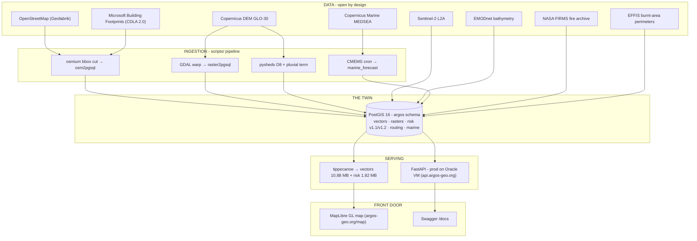

# ARGOS : : Kefalonia Digital Twin

**Watching over the places we call home.**
*«Προστατεύοντας τους τόπους μας»*

ARGOS is an open-source digital twin of **Kefalonia, Greece** - one island, fully
mapped, queryable, and watchable. Built in public by one person, on open data and
free-tier infrastructure.

**[🗺️ Open the live map](https://argos-geo.org/map)** - roads, buildings, beaches,
wildfire risk, flash-flood risk, fire-response coverage, and modelled marine
exposure for 14 pilot beaches. Click anything; it answers.

---

## The 3-minute version

**What is it?** A PostgreSQL/PostGIS database that holds the whole island -
12,217 road segments (3,764 km), 46,934 buildings (OSM + Microsoft footprints,
conflated), 1,831 POIs, 197 beaches, 29 trails, terrain (Copernicus DEM 30 m),
vegetation (Sentinel-2), EMODnet bathymetry, and four validated screening layers -
served through a FastAPI and a static vector-tile map.

**What already works (v0.0.7):**

- **Interactive map** - MapLibre GL + PMTiles, served from GitHub Pages
- **Spatial API** - `/layers` `/buffer` `/intersect` `/aggregate`, demo queries < 500 ms
- **ARGOS WATCH: Wildfire Risk v1.2** - CLC 2018 fuel model; validated against 24
  EFFIS fire perimeters (21/24 above island mean) and 397 NASA FIRMS detections
  (71.54% in class ≥3 vs 47.28% island baseline; class-4 enrichment ~4.8x).
  Directional validation, not proof.
- **ARGOS WATCH: Flash-Flood v1.1** - D8 fluvial + pluvial ponding term; validated
  against the Feb 2025 storm (Τραπεζάκι 97.5, Πόρος 96.9, Περατάτα 94.6, Βλαχάτα
  69.2 partial) and the ΓΓΠΠ Sep 2022 historical flood map. Karst blind spots
  (Katavothres) documented.
- **Fire-response coverage** - pgRouting network (21,811 segments); 42,340
  buildings carry travel times. 76.6% beyond the 15-minute envelope. Median
  response: OSM stock 43.4 min, Microsoft stock 33.3 min.
- **ARGOS WATCH: Marine exposure** - 14 pilot beaches; Copernicus Marine (CMEMS)
  hourly waves + 2D surface currents, refreshed twice daily; direction-gated wave
  score (70%) + current score (30%); animated current particles. Modelled offshore
  conditions translated into a beach exposure assessment - never a rip-current
  warning or safety certification. Ships unvalidated; first in the validation queue.

**What it costs to run:** €0/month, including always-on production (Oracle Always
Free ARM VM + Cloudflare Pages + GitHub Pages).

## Architecture

```mermaid
flowchart TB
    subgraph DATA["DATA - open by design"]
        OSM["OpenStreetMap (Geofabrik)"]
        MS["Microsoft Building Footprints (CDLA 2.0)"]
        DEM["Copernicus DEM GLO-30"]
        S2["Sentinel-2 L2A"]
        EMOD["EMODnet bathymetry"]
        CMEMS["Copernicus Marine MEDSEA"]
        FIRMS["NASA FIRMS fire archive"]
        EFFIS["EFFIS burnt-area perimeters"]
    end

    subgraph INGEST["INGESTION - scripts/ pipeline"]
        O2P["osmium bbox cut → osm2pgsql"]
        R2P["GDAL warp → raster2pgsql"]
        HYDRO["pysheds D8 + pluvial term"]
        MAR["CMEMS cron → marine_forecast"]
    end

    subgraph TWIN["THE TWIN"]
        PG[("PostGIS 16 - argos schema<br/>vectors · rasters · risk v1.1/v1.2 · routing · marine")]
    end

    subgraph SERVE["SERVING"]
        API["FastAPI - prod on Oracle VM (api.argos-geo.org)"]
        PMT["tippecanoe → vectors 10.88 MB + risk 1.82 MB"]
    end

    subgraph FRONT["FRONT DOOR"]
        MAP["MapLibre GL map (argos-geo.org/map)"]
        DOCS["Swagger /docs"]
    end

    OSM --> O2P --> PG
    MS --> O2P
    DEM --> R2P --> PG
    DEM --> HYDRO --> PG
    S2 --> PG
    EMOD --> PG
    CMEMS --> MAR --> PG
    FIRMS --> PG
    EFFIS --> PG
    PG --> API --> DOCS
    PG --> PMT --> MAP
```
Run locally with `docker compose up -d` in a GitHub Codespace - see
[`DEV_SETUP.md`](DEV_SETUP.md). Every pipeline step is a numbered, committed
script in [`scripts/`](scripts/); every model has an open methodology document
([wildfire](METHODOLOGY_Wildfire_Risk.md) ·
[flash flood](METHODOLOGY_Flash_Flood.md) ·
[accessibility](METHODOLOGY_Accessibility.md)) with an honest limitations section.

## The three sub-brands

| Mark | What it is |
|---|---|
| **ARGOS GEO** | The twin itself - data, pipelines, API, map |
| **ARGOS WATCH** | The monitoring and validation program: hazard screening layers checked against real events, hit rates published, misses logged |
| **ARGOS COMMONS** | Citizen input and open data stewardship - the open horizon |

## Honest status

The risk layers are expert-weighted **screening baselines with directional
validation, never forecasts**. Real-time feeds and dynamic risk are v0.2.0
(roadmap in the issues). The marine layer is unvalidated (no independent buoy on
Kefalonia) and says so on the map. Ithaca buildings show honest no-data gray
until travel-times v1.1 (ferry legs) ships.

## Data & licenses

Code: **MIT**. Derived layers: **CC BY 4.0**. Sources: © OpenStreetMap contributors
(ODbL), Microsoft Building Footprints (CDLA Permissive 2.0), Copernicus DEM,
Sentinel-2 / ESA, NASA FIRMS, EFFIS / Copernicus EMS, EMODnet, Copernicus Marine.
Attribution is architecture, not decoration.

---

## Ελληνικά 🇬🇷

# ARGOS : : Ψηφιακός Δίδυμος Κεφαλονιάς

**Προστατεύοντας τους τόπους μας.**

Ο ARGOS είναι ένα ανοιχτού κώδικα ψηφιακό δίδυμο της **Κεφαλονιάς** - ολόκληρο το
νησί, χαρτογραφημένο, ερωτήσιμο και παρατηρήσιμο. Χτίζεται δημόσια από έναν
άνθρωπο, με ελεύθερα δεδομένα και δωρεάν υποδομή.

**[🗺️ LIVE map](https://argos-geo.org/map)** - δρόμοι, κτίρια, παραλίες, κίνδυνος
πυρκαγιάς, πλημμύρας, πυροσβεστικής κάλυψης και θαλάσσια έκθεση για 14 παραλίες.
Κάνε κλικ οπουδήποτε· απαντάει.

### Σε 3 λεπτά

**Τι είναι;** Μια βάση PostgreSQL/PostGIS που κρατά ολόκληρο το νησί - 12.217
τμήματα δρόμων (3.764 χλμ.), 46.934 κτίρια (OSM + Microsoft), 1.831 σημεία
ενδιαφέροντος, 197 παραλίες, 29 μονοπάτια, ανάγλυφο (Copernicus DEM 30 μ.),
βλάστηση (Sentinel-2), βυθομετρία EMODnet και τέσσερα επικυρωμένα επίπεδα
κινδύνου - που σερβίρονται μέσω FastAPI και στατικού χάρτη vector tiles.

**Τι δουλεύει ήδη (v0.0.7):**

- **Διαδραστικός χάρτης** - MapLibre GL + PMTiles
- **Χωρικό API** - `/layers` `/buffer` `/intersect` `/aggregate`
- **ARGOS WATCH: Κίνδυνος Πυρκαγιάς v1.2** - μοντέλο καυσίμης ύλης CLC 2018·
  επικυρωμένος με 24 περιμέτρους EFFIS (21/24 πάνω από τον μέσο όρο) και 397
  ανιχνεύσεις NASA FIRMS (71,54% σε κλάση ≥3, έναντι 47,28% του νησιού).
  Κατευθυντική επικύρωση, όχι απόδειξη.
- **ARGOS WATCH: Πλημμύρα v1.1** - απορροή D8 + πλημμυρικός όρος· επικυρωμένο με
  την καταιγίδα Φεβρουαρίου 2025 (Τραπεζάκι 97,5 · Πόρος 96,9 · Περατάτα 94,6 ·
  Βλαχάτα 69,2 μερικό) και τον ιστορικό χάρτη πλημμυρών ΓΓΠΠ Σεπ. 2022.
- **Πυροσβεστική κάλυψη** - δίκτυο pgRouting (21.811 τμήματα)· 42.340 κτίρια με
  χρόνους πρόσβασης, 76,6% εκτός 15λεπτου.
- **ARGOS WATCH: Θαλάσσια έκθεση** - 14 παραλίες· κύματα και επιφανειακά ρεύματα
  Copernicus Marine, δύο φορές την ημέρα· κινούμενα σωματίδια ρευμάτων. Μοντελοποιημένες
  θαλάσσιες συνθήκες μεταφρασμένες σε ένδειξη έκθεσης παραλίας - ποτέ προειδοποίηση
  ρευμάτων ή πιστοποίηση ασφαλείας. Ανεπικύρωτο, πρώτο στην ουρά επικύρωσης.

**Κόστος λειτουργίας:** 0 €/μήνα, συμπεριλαμβανομένης της παραγωγής 24/7
(Oracle Always Free + Cloudflare Pages + GitHub Pages).

#### Τα τρία υπό-σήματα

| Σήμα | Τι είναι |
|---|---|
| **ARGOS GEO** | Το ίδιο το δίδυμο - δεδομένα, pipelines, API, χάρτης |
| **ARGOS WATCH** | Το πρόγραμμα παρακολούθησης και επικύρωσης: επίπεδα κινδύνου ελεγμένα με πραγματικά γεγονότα, με δημοσιευμένα ποσοστά επιτυχίας και καταγεγραμμένες αστοχίες |
| **ARGOS COMMONS** | Συμμετοχή πολιτών και διαχείριση ανοικτών δεδομένων - ο ανοιχτός ορίζοντας |

#### Ειλικρινής κατάσταση

Τα επίπεδα κινδύνου είναι **βασικές γραμμές διαλογής με κατευθυντική επικύρωση,
ποτέ προγνώσεις**. Ροές πραγματικού χρόνου και δυναμικός κίνδυνος είναι v0.2.0
(roadmap στα issues). Το θαλάσσιο στρώμα είναι ανεπικύρωτο (δεν υπάρχει ανεξάρτητος
πλωτός σταθμός στην Κεφαλονιά) και το δηλώνει στον χάρτη. Τα κτίρια της Ιθάκης
εμφανίζουν τίμια γκρι ένδειξη έλλειψης δεδομένων μέχρι το travel-times v1.1.

#### Δεδομένα & άδειες

Κώδικας: **MIT**. Παράγωγα επίπεδα: **CC BY 4.0**. Πηγές: © OpenStreetMap contributors
(ODbL), Microsoft Building Footprints (CDLA Permissive 2.0), Copernicus DEM,
Sentinel-2 / ESA, NASA FIRMS, EFFIS / Copernicus EMS, EMODnet, Copernicus Marine.

---

*Built in Kefalonia · argos-geo.org · hello@argos-geo.org*
*"Watching over the places we call home."*
